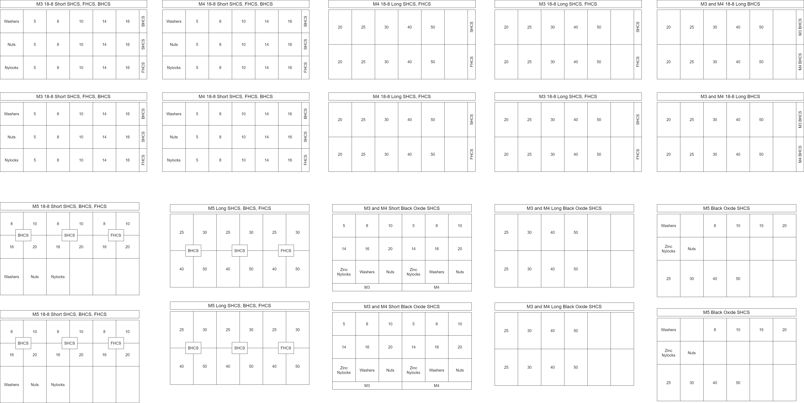

# Brief Notes on a Hardware Kit 

I put these boxes together for the CBA basement, I suspect I'll do it again at some other shop in the future. So here's the templates, some photos, etc.

The .drawio format - I hope still exists when this is being used again - is a great and useful tool for this. In this one, things are repeated so that they can be printed on US Letter size paper, folded, then trimmed and taped in to boxes. 

Boxes are from McMaster, I'm including a complete pdf of the whole order. 

- Smaller Boxes Case PN 45505T21 
- Smaller Boxes PN 45505T9 (+ no. compartments 6, 12, 18) 

## Spacers and Standoffs Addition

These are valuable to add... our set includes:

- M3 Spacers 4.5mm OD @
  - 2, 3, 4, 5, 6, 7, 8, 10, 12, 14, 16, 18, 20
- M3 Standoffs 4.5mm Hex Male-Female @ 
  - 5, 6, 8, 10, 12, 14, 16, 20 (18 not available) 
- M3 Standoffs, 4.5mm Hex Female-Female @ 
  - 3, 4, 5, 6, 8, 10, 12, 14, 16, 18, 20 

A similar set for M2.5 is valuable, many circuits are mounted at this spec.