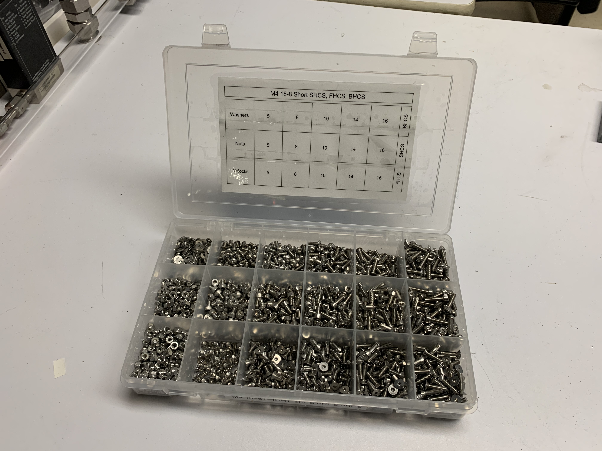
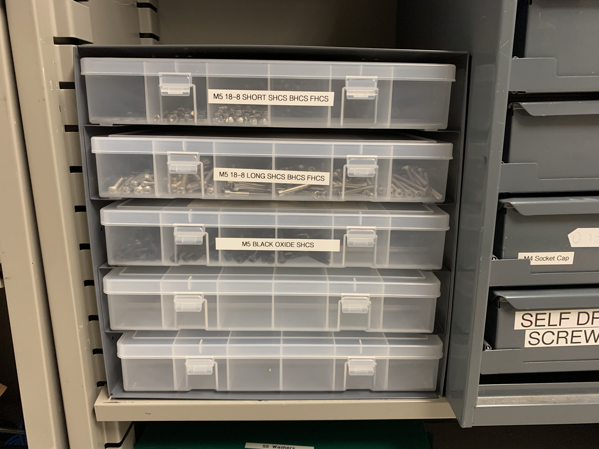

# Brief Notes on a Hardware Kit 

I put these boxes together for the CBA basement, I suspect I'll do it again at some other shop in the future. So here's the templates, some photos, etc.

The .drawio format - I hope still exists when this is being used again - is a great and useful tool for this. In this one, things are repeated so that they can be printed on US Letter size paper, folded, then trimmed and taped in to boxes. 

Boxes are from McMaster, I'm including a complete pdf of the whole order. 